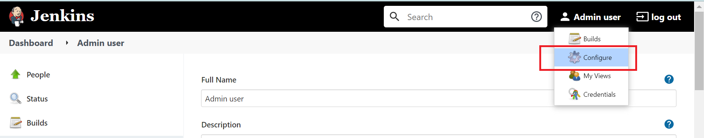
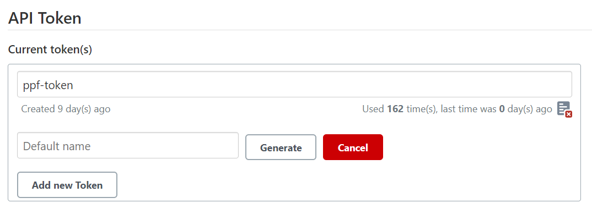

# Run jenkins locally as docker container

Go to ppf_support_tools repo and build jenkins image
```
docker build -t ppf_jenkins:1.0 .
```

Create docker volume
```
docker volume create vol_jenkins
```

Run jenkins container
```
docker container run -d -p 8080:8080 -v vol_jenkins:/var/jenkins_home --name ppf_jenkins ppf-jenkins:1.0
```

Check if jenkins container is running and get container id
```
docker ps
```

Get initial admin password
```
docker container exec ppf_jenkins sh -c "cat /var/jenkins_home/secrets/initialAdminPassword"
```

Go to http://localhost:8080

Install recommended plugins
## Install plugins
Go to Jenkins portal -> manage Jenkins -> Manage Pluging
In Manager Plugin page click "Available" tab and Install following plugins.
  1. Environment Injector Plugin
  2. Azure Credentials
  3. Pipeline
  4. Pipeline Utility Steps
Click on "Install without restart" and wait till installation gets completed.

## Setup Azure account service principle
Once Installation of plugins are completed,
  1. Go to Jenkins -> Manage Jenkins -> Manage Credentials
  2. Go to  Store "Jenkins"
  3. Go to Global credentials (unrestricted)
  4. Go to "Add Credentials"
  5. In Kind select "Azure Service Prinicipal"
  6. Enter Subscription ID
  7. Enter Client ID
  8. Enter Client Secret
  9. Enter Tenant ID
  10. Enter ID as "SEMICOLON_AZURE_PROD_ACCOUNT_1"
  11. Save Changes
 
## Setup Job
### Create Job
  1. Go to Jenkins-> New Item
  2. Enter "jenkins-pipeline-job" in name
  3. Select "Pipeline" in job
  4. Click "Ok" to create.
### Configure Job 
  1. Go to Job --> Select Configure
  2. In configuration page, under General, select checkbox "Prepare an environment for the run"
  3. In Build Triggers, select "Trigger builds remotely (e.g., from scripts)" and in token add "ppf-token"
### Configure Job Pipeline
  1. In Job Pipeline, select Defination "Pipeline Script from SCM"
  2. In SCM, Select "Git"
  3. In Repository URL, enter https://<yourtoken>@github.com/PSLGRP/ppf_provisioning.git
  4. In branch enter "master"
  5. In script path keep "Jenkinsfile"
  

Set intial admin user as 'admin' / 'secret'

References - 
https://rangle.io/blog/running-jenkins-and-persisting-state-locally-using-docker-2/#:~:text=%20Running%20Jenkins%20and%20Persisting%20state%20locally%20using,sure%20that%20we%20can%20recover%20our...%20More%20


# Setup pipeline project in Jenkins

## Configure API token

Go to Jenkins portal using your jenkins credentials

Click on the `Configure` option under your username



Go to `API Token`. Provide name as `ppf-token` and select `Generate`. Copy the new token and keep it safe.




